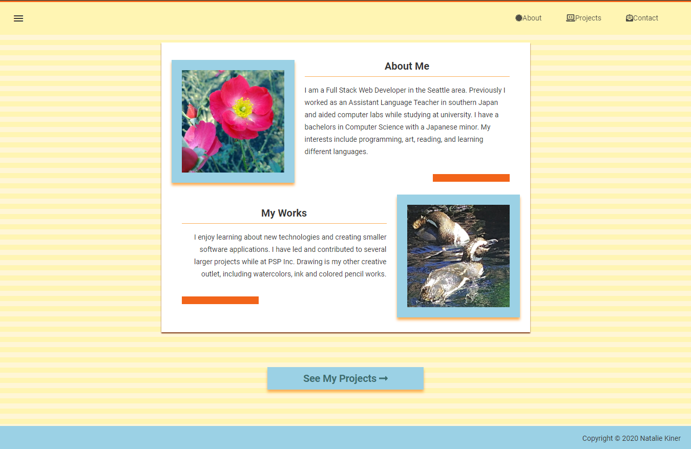
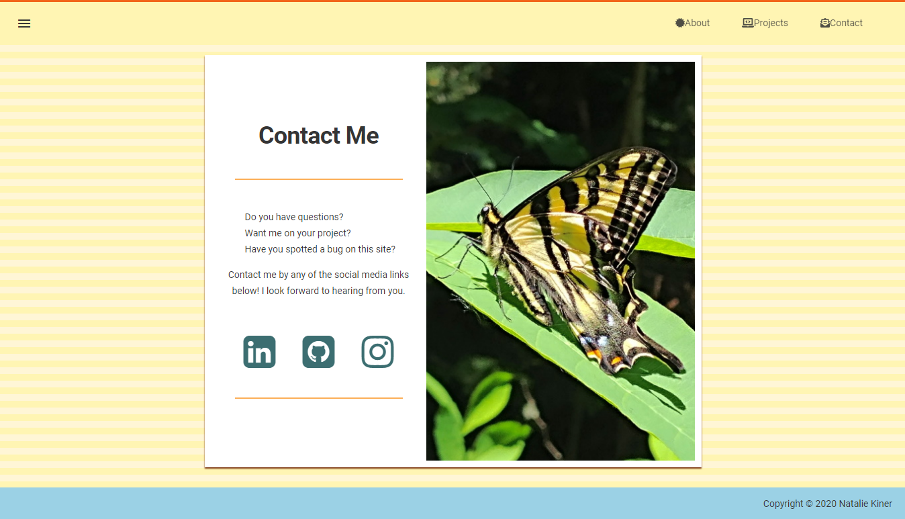

# React Portfolio
A single scroll portfolio website.  
Originally this was multipage but I felt it would be more efficent to use as a single scroll website.  
Includes a Landing section, About section, Project Cards, and Contact Form.  
Website: [https://kinern.github.io/kinern-portfolio](https://kinern.github.io/kinern-portfolio)

---

#### Uses the following:
- Boostrap Components (Navigation, Scrollspy, Layouts, Button and Form Styling)
- Formspree form integration
- FontAwesome Icons and Material Community Icons
- AOS (Animate On Scroll) Transitions

---

## Screenshots

### Previous Layouts

#### Version 1

---
